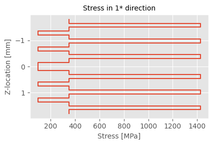
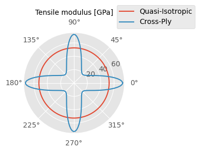
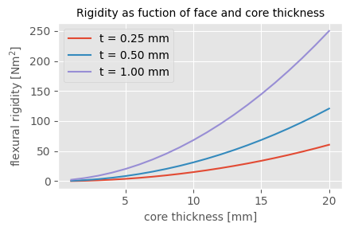

# Tompouce example gallery

Below you can find a few examples to demonstrate how Tompouce works.
The accompanying Python files can be found in the `examples` folder.
The first two examples are quite verbose to provide a bit of context.
Specifically, the following examples can be found below:
- [Uniaxial tensile test](#uniaxial-tensile-test)
- [Deformation due to a thermal load](#thermal-load)
- [Quasi-isotropy](#quasi-isotropy)
- [Sandwich beam](#sandwich-beam)
- [Drive shaft](#drive-shaft)
- [Pressure vessel](#pressure-vessel)

## Uniaxial tensile test

Consider a quasi-isotropic fiber reinforced composite test specimen
with a width of 25 mm that is subjected to a tensile test. We will:
- Determine the Young's modulus in X-direction
- Check for failure in case a load of 50 kN is applied

```python
from tompouce import Material, Laminate, Load, QI_layup
from failure_criteria import Tsai_Hill
```

First, we create an instance of the Material class, which holds all
relevant material properties. There are two ways to create a Material
object. We can:
- import data from a json file, or
- provide a dictionary with the relevant data.

Here, we will import data from a json file:

```python
TC1200 = Material('../materials/TC1200_UD.json')
```

We can print the object to learn about the material properties:

```python
print(TC1200)
```

which prints:

```
TC1200 UD
-----------------------------
Manufacturer:   Toray AC
Matrix:         PEEK
Fiber:          Carbon - Intermediate Modulus

Thermoelastic properties
-----------------------------
E1:               135.0 GPa
E2:                10.0 GPa
G12:                5.2 GPa
v12:               0.28
alpha1:            0.40 um/m
alpha2:           30.00 um/m

Strength
-----------------------------
S1t:             2410.0 MPa
S1c:             1300.0 MPa
S2t:               86.0 MPa
S2c:              100.0 MPa
S6:               152.0 MPa
```

Next we create a Laminate object. Again, there are two ways to do so.
We can:
- provide a list of ply instances, which is demonstrated in the next
  example, or
- provide a Material object, a list with fiber orientation angles, and
  a ply thickness (equal for all plies).

Here we follow the seciond approach, making use of the function
`QI_layup()` to generate the orientation angles for a quasi-isotropic
layup:

```python
ply_thickness = 0.15E-3
layup = QI_layup(24)
QI_laminate = Laminate(layup, TC1200, ply_thickness)
```

In case we would like information about our Laminate objects, such as
the elastic properties, we can again simply use the print statement:

```python
print(QI_laminate)
```

```
Material                 Thickness   Orientation
------------------------------------------------ Top
TC1200 UD                  0.15 mm      45.0 deg
TC1200 UD                  0.15 mm       0.0 deg
TC1200 UD                  0.15 mm     -45.0 deg
TC1200 UD                  0.15 mm      90.0 deg
TC1200 UD                  0.15 mm      45.0 deg
TC1200 UD                  0.15 mm       0.0 deg
TC1200 UD                  0.15 mm     -45.0 deg
TC1200 UD                  0.15 mm      90.0 deg
TC1200 UD                  0.15 mm      45.0 deg
TC1200 UD                  0.15 mm       0.0 deg
TC1200 UD                  0.15 mm     -45.0 deg
TC1200 UD                  0.15 mm      90.0 deg
TC1200 UD                  0.15 mm      90.0 deg
TC1200 UD                  0.15 mm     -45.0 deg
TC1200 UD                  0.15 mm       0.0 deg
TC1200 UD                  0.15 mm      45.0 deg
TC1200 UD                  0.15 mm      90.0 deg
TC1200 UD                  0.15 mm     -45.0 deg
TC1200 UD                  0.15 mm       0.0 deg
TC1200 UD                  0.15 mm      45.0 deg
TC1200 UD                  0.15 mm      90.0 deg
TC1200 UD                  0.15 mm     -45.0 deg
TC1200 UD                  0.15 mm       0.0 deg
TC1200 UD                  0.15 mm      45.0 deg
------------------------------------------------ Bottom
# plies: 24                3.60 mm

Engineering constants
---------------------
Young's Modulus X:   52.6 GPa
Young's Modulus Y:   52.6 GPa
Shear Modulus X:     20.1 GPa
Poisson's ratio XY:  0.31
Poisson's ratio YX:  0.31
Flexural modulus X:  55.2 GPa
Flexural modulus Y:  42.5 GPa
```

Next, a Load object is needed. There are two ways to create such an
object. We can:
- import data from a json file, or
- provide a dictionary with the relevant data.

Here, we will create a Load object from a dictionary. The dictionary
should have the following keys:
- Fx OR ex      : normal load OR strain in x-direction
- Fy OR ey      : normal load OR strain in y-direction
- Fxy OR exy    : shear load OR shear strain
- Mx OR kx      : bending moment OR curvature in x-direction
- My OR ky      : bending moment OR curvature in y-direction
- Mxy OR kxy    : twisting moment OR curvature
- dT (optional) : temperature difference

```python
F, width = 50E3, 25E-3
loading_conditions = {'Fx': F/width, 'Fy': 0.0, 'Fxy': 0.0,
                      'Mx': 0.0, 'My': 0.0, 'Mxy': 0.0, 'dT': 0.0}
uniaxial_tension = Load(loading_conditions)
```

A Load object serves as argument to several Laminate methods. For
example, we can determine the deformation of the laminate due to the
applied load.

```python
F, d = QI_laminate.loaddef(uniaxial_tension)
```

Alternatively, we can also print this information in a pretty way:

```python
QI_laminate*uniaxial_tension
```

```
Deformation                               Load        Thermal Load

{ 1.06E-02}     [ a a a | b b b ]    ( { 2.00E+06}    { 0.00E+00} )
{-3.23E-03}     [ a a a | b b b ]    ( { 0.00E+00}    { 0.00E+00} )
{ 4.38E-19}     [ a a a | b b b ]    ( { 0.00E+00}    { 0.00E+00} )
{---------}  =  [---------------]    ( {---------} +  {---------} )
{ 8.10E-16}     [ b b b | d d d ]    ( { 0.00E+00}    { 0.00E+00} )
{-1.96E-17}     [ b b b | d d d ]    ( { 0.00E+00}    { 0.00E+00} )
{-4.22E-16}     [ b b b | d d d ]    ( { 0.00E+00}    { 0.00E+00} )
```

We can also plot the stress distribution in the laminate. Here, we
plot the 1st normal stress in ply CS.
```python
QI_laminate.plot_stress(uniaxial_tension, comp=0, CS='ply')
```

<p align="left">
	
</p>

Lastly, we can check for 1st ply failure according to specified
failure criterion.

```python
QI_laminate.print_failure(uniaxial_tension, Tsai_Hill)
```

```
Ply failure overview
Ply #     Top            Bottom
-------------------------------
1         OK!            OK!
2         OK!            OK!
3         OK!            OK!
4         Failed         Failed
5         OK!            OK!
6         OK!            OK!
7         OK!            OK!
8         Failed         Failed
9         OK!            OK!
10        OK!            OK!
11        OK!            OK!
12        Failed         Failed
13        Failed         Failed
14        OK!            OK!
15        OK!            OK!
16        OK!            OK!
17        Failed         Failed
18        OK!            OK!
19        OK!            OK!
20        OK!            OK!
21        Failed         Failed
22        OK!            OK!
23        OK!            OK!
24        OK!            OK!
```

## Thermal load

A non-symmetric laminate is subjected to a temperature change. We will
use Tompouce to:
- calculate the resulting curvature, and
- the bending moment required to flatten the laminate.

```python
from tompouce import Material, Ply, Laminate, Load
from numpy import pi
```

First, a Material object is created. This time we use a dictionary
to create the object.

```python
mdata = {'name': "TC1225", 'manufacturer': "Toray AC",
         'fiber': "Carbon AS4", 'matrix': "Victrex LM-PAEK",
         'E1': 135E9, 'E2': 10E9, 'v12': 0.26, 'G12': 4.3E9,
         'alpha1': 4E-7, 'alpha2': 3E-5,
         'S1t': 2410E6, 'S1c': 1300E6, 'S2t': 86E6, 'S2c': 100E6, 'S6': 42E6}
TC1225 = Material(mdata)
```

Next, we create two Ply objects: one with a fiber orientation of 0
degrees and one with an orientation of 90 degrees, which are used to
define a Laminate object.

```python
ply_thickness = 0.14E-3
P00 = Ply(TC1225, 0, ply_thickness)
P90 = Ply(TC1225, pi/2, ply_thickness)

CP_laminate = Laminate([P00, P00, P00, P90, P90, P90])
```

The laminate is cooled down from a (stress-free) glass transition
temperature, while no load is applied.

```python
dT = -130
loading_conditions = {'Fx': 0.0, 'Fy': 0.0, 'Fxy': 0.0,
                      'Mx': 0.0, 'My': 0.0, 'Mxy': 0.0, 'dT': dT}
thermal_load = Load(loading_conditions)
```

The resulting deformations can be calculated as:

```python
_, d = CP_laminate.loaddef(thermal_load)
print(f"Curvature (x-direction): {d[3]:.2f} -/m")
print(f"Curvature (y-direction): {d[4]:.2f} -/m")
print(f"Twisting curvature: {d[5]:.2f} -/m")
```

```
Curvature (x-direction): -3.98 -/m
Curvature (y-direction): 3.98 -/m
Twisting curvature: 0.00 -/m
```

The bending moments to flatten the laminate can be easily computed as
well. As a first step we define a new loading condition, where we
force the curvatures equal to zero.

```python
loading_conditions = {'Fx': 0.0, 'Fy': 0.0, 'Fxy': 0.0,
                      'kx': 0.0, 'ky': 0.0, 'kxy': 0.0, 'dT': -130.0}
combined_load = Load(loading_conditions)
```

The required bending moments can be extracted from the force vector.

```python
force, _ = CP_laminate.loaddef(combined_load)
print(f"Required moment (x-direction): {force[3]:.2f} Nm/m")
print(f"Required moment (y-direction): {force[4]:.2f} Nm/m")
print(f"Required twisting moment: {force[5]:.2f} Nm/m")
```

```
Required moment (x-direction): 6.10 Nm/m
Required moment (y-direction): -6.10 Nm/m
Required twisting moment: -0.00 Nm/m
```

## Quasi-isotropy

We will now calculate the modulus of a quasi-isotropic and cross-ply
laminate as a function of the in-plane orientation angle.

```python
from tompouce import Material, Laminate, QI_layup, CP_layup
import numpy as np
import matplotlib.pyplot as plt
```

First, we import the material properties and create our Laminate
objects.

```python
# Import Material object
TC1200 = Material('../materials/TC1200_UD.json')
ply_thickness = 0.15E-3

# Create the Laminate objects and store in array
QI_laminate = Laminate(QI_layup(24), TC1200, ply_thickness)
CP_laminate = Laminate(CP_layup(24), TC1200, ply_thickness)
```

Next we use method `layup_rotate` to rotate the layup and the method `engineering_constants()` to extract the the modulus.

```python
# Orientation angles and modulus
theta = np.linspace(0, 2*np.pi, 200)
modulus = np.zeros((2, len(theta)))
modulus[0, 0] = QI_laminate.engineering_constants()['Ex']
modulus[1, 0] = CP_laminate.engineering_constants()['Ex']

dtheta = theta[1] - theta[0]
for i in range(1, len(theta)):
    QI_laminate.layup_rotate(-dtheta)
    CP_laminate.layup_rotate(-dtheta)
    modulus[0, i] = QI_laminate.engineering_constants()['Ex']
    modulus[1, i] = CP_laminate.engineering_constants()['Ex']

```

Finally, we plot the results.

```python
with plt.style.context('ggplot'):
    fig, ax = plt.subplots(figsize=(4.5, 3),
                           subplot_kw={'projection': 'polar'})
    ax.plot(theta, modulus[0]/1E9, label="Quasi-Isotropic")
    ax.plot(theta, modulus[1]/1E9, label="Cross-Ply")
    ax.legend(bbox_to_anchor=(1, 1), bbox_transform=fig.transFigure)
    ax.set_title("Tensile modulus [GPa]", fontsize=10)
    fig.tight_layout()
    plt.savefig('../img/quasi_isotropy.png', bbox_inches='tight')
```

<p align="left">
	
</p>

## Sandwich beam

Calculate the flexural rigidity of sandwich beams. All beams have a
width of 2 cm. Three different face sheet thicknesses are used, namely
0.25, 0.5 and 1.0 mm, while the core thickness is varied between 1 and
20 mm.

```python
from tompouce import Material, Ply, Laminate
import numpy as np
import matplotlib.pyplot as plt
```

First, we will create the ply and core objects.

```python
# Core thickness and beam width
core_thickness = np.linspace(1E-3, 2E-2, 20, endpoint=True)
b = 0.02

# The skin material properties are imported from a json file
TC1100 = Material('../materials/TC1100_5HS.json')
ply_thickness = 0.25E-3
ply = Ply(TC1100, 0.0, ply_thickness)

# The core material is generated from a dict
foam = Material({'name': 'Core',
                 'E1': 250E6, 'E2': 400E6,
                 'v12': 0.32, 'G12': 850E6})
core = Ply(foam, 0.0, core_thickness[0])

# Create the Laminate objects and store in array
sandwich = [Laminate([ply, core, ply]),
            Laminate([ply, ply, core, ply, ply]),
            Laminate([ply, ply, ply, ply, core, ply, ply, ply, ply])]
```

Next the bending rigidity is calculated and plotted.

```python
# Calculate results
rigidity = np.zeros((3, len(core_thickness)))
for i, thickness in enumerate(core_thickness):
    core.t = thickness
    rigidity[0, i] = b/sandwich[0].abd()[3, 3]
    rigidity[1, i] = b/sandwich[1].abd()[3, 3]
    rigidity[2, i] = b/sandwich[2].abd()[3, 3]

# Plot results
with plt.style.context('ggplot'):
    fig, ax = plt.subplots(figsize=(4.5, 3))
    ax.plot(core_thickness*1E3, rigidity[0], label="t = 0.25 mm")
    ax.plot(core_thickness*1E3, rigidity[1], label="t = 0.50 mm")
    ax.plot(core_thickness*1E3, rigidity[2], label="t = 1.00 mm")
    ax.legend()
    ax.set_title('Rigidity as function of face and core thickness',
                 fontsize=10)
    ax.set_xlabel('core thickness [mm]', fontsize=10)
    ax.set_ylabel('flexural rigidity [Nm$^2$]', fontsize=10)
    fig.tight_layout()
    plt.savefig('../img/sandwich.png', bbox_inches='tight')
```

<p align="left">
	
</p>


## Drive shaft

Consider three drive shafts with a length of 1.25 m. All shafts have a
[45/-45]_5s layup but different radii, namely 25 mm, 50 mm and 75 mm.
The shaft is loaded with a torque of 500 Nm. Calculate the maximum
angular deformation for each shaft.

```python
from tompouce import Material, Laminate, torsion_shaft
from numpy import rad2deg, deg2rad

# Parameters
radii = [25E-3, 50E-3, 75E-3]
torque = 500.0
length = 1.25

# The material properties are imported from a json file
TC1200 = Material('../materials/TC1200_UD.json')

# Create the Laminate object
ply_thickness = 0.15E-3
layup = [45.0, -45.0, 45.0, -45.0, 45.0, -45.0, 45.0, -45.0, 45.0, -45.0,
         -45.0, 45.0, -45.0, 45.0, -45.0, 45.0, -45.0, 45.0, -45.0, 45.0]
bias_laminate = Laminate(deg2rad(layup), TC1200, ply_thickness)

# Create the three Load objects, and store these in a list
loads = [torsion_shaft(torque, radius) for radius in radii]

# Calculate and print deformations
print("Resulting deformations\n----------------------")
for load, radius in zip(loads, radii):
    _, d = bias_laminate.loaddef(load)
    angle = d[2]*length/radius
    print(f"Radius: {radius*1E3:4.0f} mm")
    print(f"Angle: {rad2deg(angle):4.2f} deg.\n")
```

This provides the following output:

```
Resulting deformations
----------------------
Radius:   25 mm
Angle: 3.47 deg.

Radius:   50 mm
Angle: 0.43 deg.

Radius:   75 mm
Angle: 0.13 deg.
```

## Pressure vessel

Consider a pressure vessel with a radius of 0.3 mm, which has to
withstand a pressure of 200 Bar. The layup of the pressure vessel is
[+theta/-theta]_ns. Five winding angles `theta` are considered, namely
35, 45, 55, 65 and 75 degrees. Determine which of these vessels will
fail as a result of the applied pressure.

```python
from tompouce import Material, Laminate, pressure_vessel
from failure_criteria import Tsai_Hill
import numpy as np


def layup(theta: float, n: int):
    """Function to create [+theta/-theta]_ns layup."""
    if n % 2 == 0:
        el = np.array([theta, -theta])
        half = np.repeat(el, n/2)
        return np.concatenate((half, np.flip(half)))
    else:
        raise ValueError('n should be an even number')


# Parameters
radius = 0.3
pressure = 200E5
fiber_angles = np.deg2rad([35, 45, 55, 65, 75],)
n = 32

# The material properties are imported from a json file
TC1200 = Material('../materials/TC1200_UD.json')
t = 0.15E-3  # ply thickness

# Create the Laminate objects and store these in a list
vessels = [Laminate(layup(angle, n), TC1200, t) for angle in fiber_angles]

# Load object
load = pressure_vessel(pressure, radius)

# Calculate and print results
print("Failure analysis pressure vessels")
print("---------------------------------\n")
for angle, vessel in zip(fiber_angles, vessels):
    fail = vessel.failure(load, Tsai_Hill)
    if any(fail):
        print(f"Vessel with fiber angle of {np.rad2deg(angle):3.1f} failed.")
    else:
        print(f"Vessel with fiber angle of {np.rad2deg(angle):3.1f} survived.")
```

Which shows the following output:

```
Failure analysis pressure vessels
---------------------------------

Vessel with fiber angle of 35.0 failed.
Vessel with fiber angle of 45.0 failed.
Vessel with fiber angle of 55.0 survived.
Vessel with fiber angle of 65.0 failed.
Vessel with fiber angle of 75.0 failed.
```
